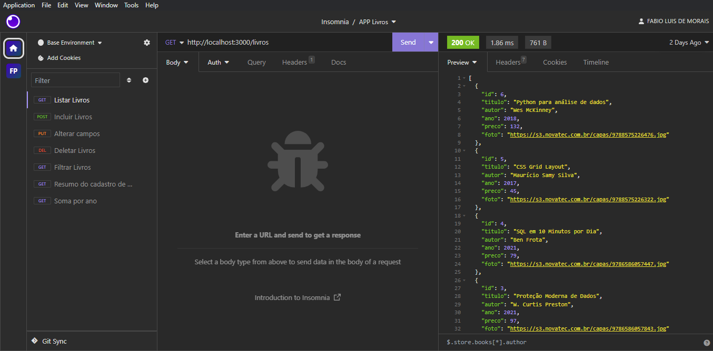

<h1 align="center">💻 API Livros</h1>



## 📝 Descrição

Sistema Web Service que realiza operações básicas de inclusão, alteração, consulta e exclusão de dados em uma página Web.

## Índice

- [📝 Descrição](#-descrição)
- [Índice](#índice)
- [Funcionalidades](#funcionalidades)
- [Tecnologias utilizadas](#tecnologias-utilizadas)
- [Rodando o projeto](#rodando-o-projeto)
- [Pacotes Utilizados](#pacotes-utilizados)

## Funcionalidades

- <b>Funcionalidade 1</b>: CRUD (Create, Read, Update e Delete);
- <b>Funcionalidade 2</b>: Filtro de dados;
- <b>Funcionalidade 3</b>: Filtro de dados gerenciais do sistema;

## Tecnologias utilizadas

&nbsp;
&nbsp;
&nbsp;
&nbsp;
&nbsp;

## Rodando o projeto

Para rodar o repositório é necessário clonar o mesmo, dar o seguinte comando para iniciar o projeto:

```bash
# Clonar o projeto
$ git clone git@github.com:Fabiolb21/APP-Livros.git

# Instalar as dependências do projeto
$ npm install express

# Instalar as dependências do projeto
$ npm install -D nodemon

```

## Pacotes Utilizados

- **EXPRESS**
- **KNEX**, que simplifica o processo de construção de intruções SQL;

---

Feito por Fabio Bernardo: [Entre em contato!](https://www.linkedin.com/in/fabioluisbernardodemorais)
